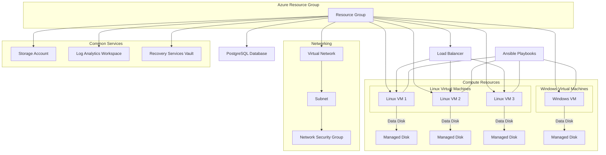

# Azure Terraform & Ansible Automation Project

This project demonstrates a complete Infrastructure as Code (IaC) solution for provisioning and configuring an Azure environment using Terraform for infrastructure provisioning and Ansible for post-deployment configuration management.

## Table of Contents
- [Overview](#overview)
- [Architecture](#architecture)
- [Repository Structure](#repository-structure)
- [Modules Overview](#modules-overview)
- [Prerequisites](#prerequisites)
- [Usage](#usage)
- [Customization](#customization)
- [License](#license)

## Overview

This solution deploys a multi-tier Azure environment consisting of:

- **Resource Group:** Centralized container for all deployed resources.
- **Networking:** Virtual Network (VNET), Subnets, and Network Security Group (NSG) to secure network traffic.
- **Common Services:** Log Analytics Workspace, Recovery Services Vault, and a Storage Account.
- **Compute:** 
  - Linux Virtual Machines (with availability sets, public IPs, network interfaces, and attached data disks)
  - Windows Virtual Machines (with availability sets, public IPs, network interfaces, and antimalware configuration)
- **Load Balancer:** Distributes incoming traffic across Linux VMs.
- **Database:** Azure PostgreSQL server and database.
- **Configuration Management:** Ansible is used to run playbooks for provisioning software and applying OS-level configurations.

## Architecture

Below is an architectural diagram of the solution:



> **Note:** To view the diagram properly, use a Markdown editor or viewer that supports Mermaid diagrams (e.g., VS Code with Mermaid Preview).

## Repository Structure

```plaintext
├── ansible
│   ├── ansible.cfg
│   ├── hosts
│   ├── n01579649-playbook.yaml
│   └── roles
│       ├── datadisk-n01579649
│       ├── profile-n01579649
│       ├── user-n01579649
│       └── webserver-n01579649
├── modules
│   ├── common-n01579649
│   ├── datadisk-n01579649
│   ├── database-n01579649
│   ├── loadbalancer-n01579649
│   ├── network-n01579649
│   ├── rgroup-n01579649
│   ├── vmlinux-n01579649
│   └── vmwindows-n01579649
├── main.tf
├── providers.tf
├── variables.tf
├── outputs.tf
└── backend.tf
```

- **ansible/**: Contains Ansible configurations and playbooks for post-provisioning tasks.
- **modules/**: Each subfolder represents a Terraform module for a specific resource group, such as networking, VMs (Linux and Windows), databases, and common services.
- **main.tf, providers.tf, variables.tf, outputs.tf**: Root-level Terraform files that tie together the various modules.
- **backend.tf**: (Optional) Configuration for remote Terraform state management.

## Modules Overview

- **Resource Group Module (`rgroup-n01579649`)**: Creates an Azure Resource Group.
- **Network Module (`network-n01579649`)**: Provisions VNET, Subnet, and NSG.
- **Common Module (`common-n01579649`)**: Sets up a Storage Account, Log Analytics Workspace, and Recovery Services Vault.
- **Linux VM Module (`vmlinux-n01579649`)**: Provisions Linux VMs with availability sets, NICs, public IPs, and attaches data disks.
- **Windows VM Module (`vmwindows-n01579649`)**: Provisions Windows VMs with similar configurations and antimalware extension.
- **Data Disk Module (`datadisk-n01579649`)**: Attaches additional managed disks to VMs.
- **Load Balancer Module (`loadbalancer-n01579649`)**: Configures a load balancer to distribute traffic across Linux VMs.
- **Database Module (`database-n01579649`)**: Creates a PostgreSQL server and database.

## Prerequisites

Before you begin, ensure you have the following installed:
- [Terraform](https://www.terraform.io/downloads)
- [Ansible](https://docs.ansible.com/ansible/latest/installation_guide/intro_installation.html)
- [Azure CLI](https://docs.microsoft.com/en-us/cli/azure/install-azure-cli)
- A valid [Azure Subscription](https://azure.microsoft.com/en-us/free/)
- An SSH key pair for accessing Linux VMs (for Windows VMs, ensure credentials are set properly)

## Usage

1. **Clone the repository:**
   ```bash
   git clone https://github.com/yourusername/your-repo.git
   cd your-repo
   ```

2. **Configure Variables:**
   - Edit the `variables.tf` file (or use a `terraform.tfvars` file) to specify your environment-specific values such as resource group name, location, and credentials.

3. **Initialize Terraform:**
   ```bash
   terraform init
   ```

4. **Plan the Deployment:**
   ```bash
   terraform plan
   ```

5. **Apply the Deployment:**
   ```bash
   terraform apply
   ```

6. **Run Ansible Playbook (Triggered Automatically via Provisioner):**
   - Linux VMs will have an embedded `null_resource` that triggers the Ansible playbook. Alternatively, you can run:
     ```bash
     ansible-playbook -i ansible/hosts ansible/n01579649-playbook.yaml
     ```

7. **Verify the Deployment:**
   - Check the Azure Portal to verify resources are created.
   - Use Log Analytics to view logs and monitor VMs.
   - Confirm that the load balancer is distributing traffic as expected.

## Customization

- **Terraform Modules:**  
  You can easily adjust parameters (like VM size, disk size, etc.) by modifying the corresponding variable files within each module.
  
- **Ansible Roles:**  
  Update the tasks, variables, and handlers in the roles under `ansible/roles/` to suit your configuration requirements.

- **Remote State:**  
  To use remote state management, configure the `backend.tf` file with your Azure Storage Account details and uncomment the backend configuration.

---
***Happy automating!***
